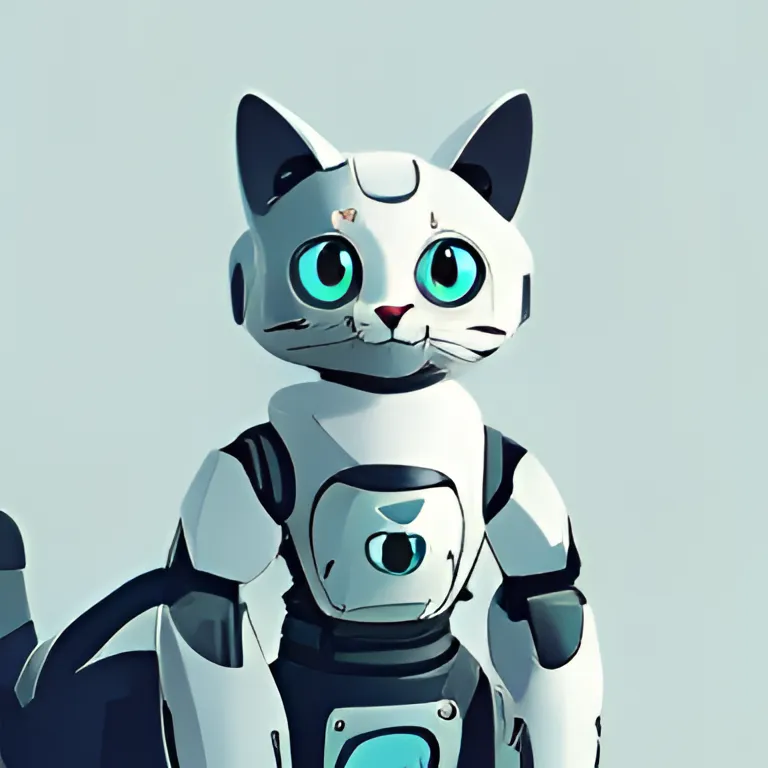

# Rosa (Robotic Operating System Agent)

Il ROS-Connect Plugin estende il framework [Chetshire AI](https://cheshirecat.ai/), permettendo a un agente AI di interagire autonomamente con un sistema ROS (Robot Operating System).

Ispirato al progetto [ROSA](https://github.com/nasa-jpl/rosa) di NASA-JPL, il plugin adotta un approccio più flessibile e scalabile: grazie all’integrazione con [roslibpy](https://roslibpy.readthedocs.io/en/latest/), un'unica istanza del framework può controllare simultaneamente più sistemi ROS senza richiedere l’installazione locale di ROS. Inoltre, l’agente può analizzare dinamicamente la documentazione del sistema ROS, adattandosi automaticamente alla configurazione del robot senza necessità di codice personalizzato.

Grazie all’ecosistema di Chetshire AI, l’interazione può essere estesa con interfacce utente personalizzabili e supporto per diversi modelli LLM, rendendo il controllo dell'agente più flessibile e adattabile a diversi scenari.

## Caratteristiche

- **Connessione e comunicazione con ROS**: Il plugin stabilisce una connessione al sistema ROS mediante [roslibpy](https://roslibpy.readthedocs.io/en/latest/), permettendo l’invio e la ricezione di messaggi sui topic ROS senza necessità di una configurazione ROS completa sul client.

- **Disponibilità API**: Grazie all’integrazione con il framework, il plugin può essere utilizzato in combinazione con i widget e le librerie client messi a disposizione dalla community per i principali linguaggi di programmazione ([more info](https://cheshire-cat-ai.github.io/docs/production/network/clients/)).

- **Flessibilità nell’utilizzo dei modelli LLM**: Supporta diverse modalità di interazione con modelli di linguaggio, consentendo l’utilizzo di API esterne o di implementazioni locali tramite OLLAMA ([more info](https://cheshire-cat-ai.github.io/docs/production/administrators/docker-compose/#cat-ollama)).

- **Configurazione automatica del sistema ROS target**:  L’agente AI analizza la documentazione del sistema ROS tramite Retrieval-Augmented Generation (RAG), identificando automaticamente i topic e la formattazione dei messaggi necessari per eseguire il task richiesto. In questo modo, l’agente si adatta a diversi robot senza la necessità di modifiche manuali o codice personalizzato.

- **Supporto multimodale** : Una funzionalità **in sviluppo** che prevede la gestione di input provenienti da diverse fonti (audio, video, testo) per arricchire la comunicazione con l’agente AI.
